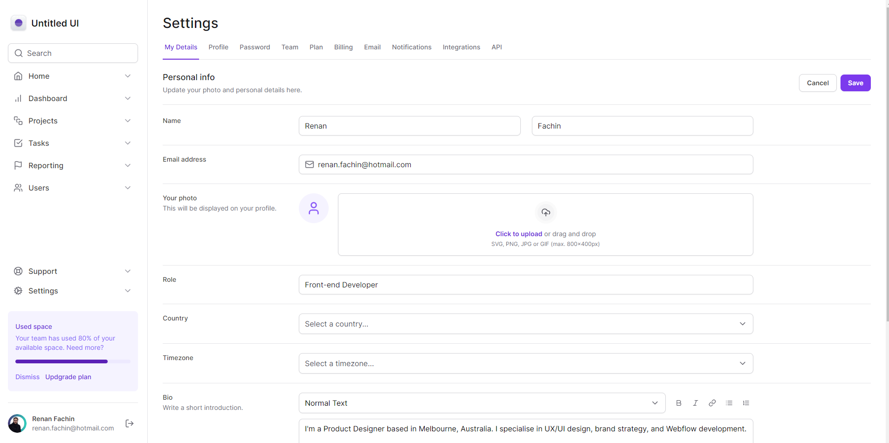

# Masterizando TAILWINDCSS

Aplicação desenvolvida durante as aulas do Masterizando TAILWINDCSS. A aplicação em questão é para o aprofundamento das habilidades no desenvolvimento de aplicações reactJS em conjunto com uma estilização utilizando uma interface declarativa.
O aplicativo, que não possui funcionalidades além de um layout bem definido e aplicando todas as melhores práticas, como acessibilidade, responsividade, animações e mais!

<p align="center">
  
</p>

<p align="center">
  
</p>


## Tabela de Conteúdos

- [To-Do](#to-do)
- [Tecnologias Utilizadas](#tecnologias-utilizadas)
- [Como Usar](#como-usar)

## To-do
- [x] Reponsividade
- [x] Animações
- [x] Label trigger
- [x] Dark e Light Themes

## Tecnologias Utilizadas

- **Next.js**: Um framework React que facilita a construção de aplicações web modernas e eficientes.
- **Tailwind CSS**: Um framework CSS utilitário que acelera o processo de estilização e torna as interfaces responsivas.
- **Radix-Ui**: Biblioteca open source de componentes com alta acessibilidade e desempenho.
- **Next-theme**: Bilioteca para abstrair o uso de themes na aplicação.
- **lucide-react**: Bilioteca de ícones.
- **framer-motion**: Biblioteca para criação e implementação de animações interativas.
- **auto-animate**: Ferramenta para adicionar animações ao projeto.


## Como Usar

1. Clone o repositório para o seu ambiente local:

```bash
git clone https://github.com/RenanFachin/RS_MasterizandoTailwindCSS
```

2. Instale as dependências do projeto:

```bash
npm install
```

4. Inicie o servidor de desenvolvimento:

```bash
npm run dev
```

5. Acesse a aplicação em seu navegador:

```
http://localhost:3000
```
